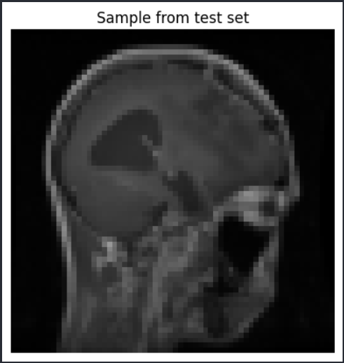
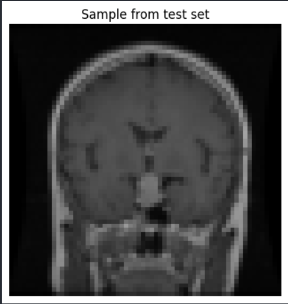
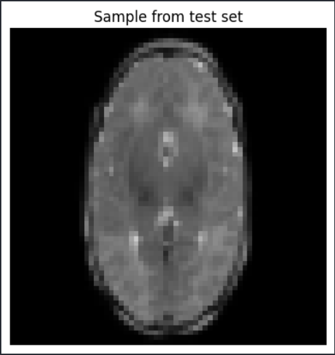
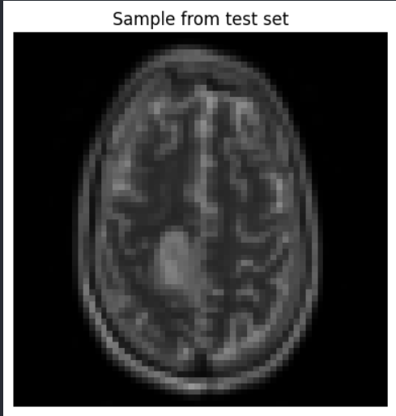
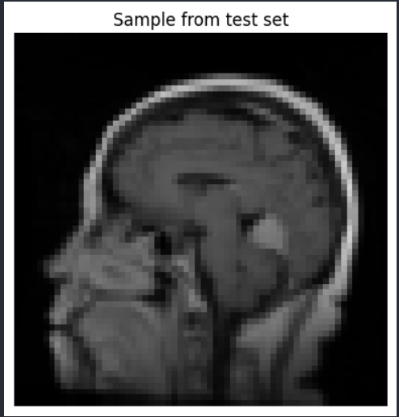

# Brain Tumor Classification using CNN

## Project Overview
This project uses a Convolutional Neural Network (CNN) to classify brain MRI images into 4 categories:
- Glioma
- Meningioma
- Pituitary
- No Tumor

## Features
- CNN model built with PyTorch
- Image classification
- Model evaluation with accuracy
- Prediction visualization

## Tech Stack
- Python
- PyTorch
- torchvision
- matplotlib

## Results
- Test Accuracy: 24% (will improve further)

## Output Samples







---

## How to Run

```bash
pip install -r requirements.txt
